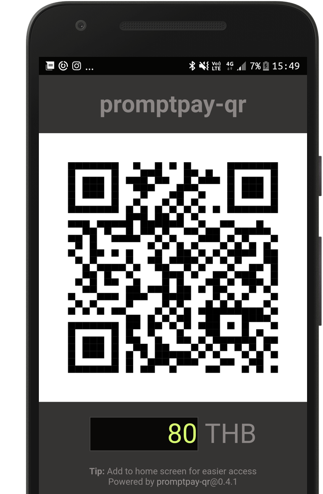
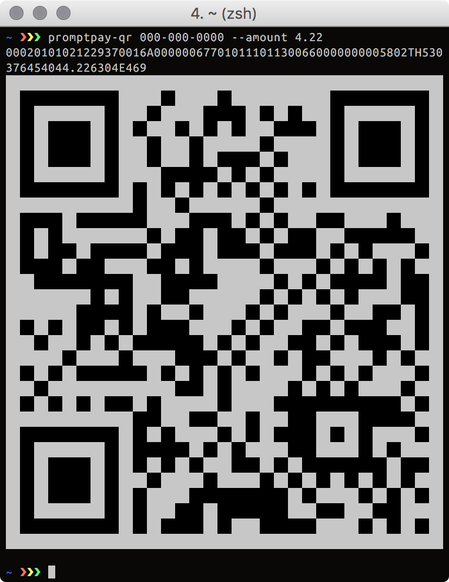

# promptpay-qr [](https://badge.fury.io/js/promptpay-qr)

[Mobile web app](#mobile-web-app), [command line app](#cli), and [JavaScript library](#api) to generate QR Code payload for PromptPay.


## Introduction

The Bank of Thailand [introduced a **PromptPay QRCode Standard**](https://thestandard.co/standardqrcode/) that works with most mobile banking apps in Thailand.

By generating a QR code, users of mobile banking apps can scan your QR code, and transfer money to your PromptPay account instantly.

**In this repository:**

- [**Mobile app**](#mobile-web-app) — Receive money from your home screen.

- [**Command-line application**](#cli) — Receive money from your terminal.

- [**`promptpay-qr` JavaScript API**](#api) — Generate a PromptPay QR code programmatically.


### What’s in a QR code

> ⚠️ Read this section to understand privacy implications of using PromptPay QR code ⚠️

- The PromptPay QR code is based on [EMV QRCPS Merchant Presented Mode](https://www.emvco.com/emv-technologies/qrcodes/) specification.

- **The QR code contains the PromptPay ID.** This means anyone who sees the QR code can find out your PromptPay ID (Phone number, National ID number, e-Wallet ID). Please treat the QR code like your personal information.

- The QR code can optionally contain the transfer amount. Mobile banking apps use this number to pre-fill the amount for convenience.

## Mobile web app

**You can quickly receive money from your home screen.**



For example, if you want to collect 80 Baht from each friend, you can open the app, type in 80, and show the QR code.
[It takes less than 5 seconds](https://www.facebook.com/dtinth/videos/10208543817227100/).

To use it:

1. Open **Chrome** (on Android) or **Safari** (iOS).

2. Go to **https://promptpay2.me/**.

3. Set your PromptPay ID.

4. “Add to Home Screen.”

Features:

- The app remembers your PromptPay ID, so you don’t have to enter the information each time.

- It is a [**Progressive Web App**](https://developers.google.com/web/progressive-web-apps/), so you can add to home screen and it will work offline (Android).

- No personal data is sent to any server. Your PromptPay ID stays in your phone/computer.


## CLI

**You can receive money from your terminal.**

<p align="center">
  
</p>

Install Node.js and run this command to install `promptpay-qr` in your machine:

```
npm install -g promptpay-qr
```

Run this command to generate a QR code:

```
promptpay-qr 081-xxx-xxxx
promptpay-qr 1-xxxx-xxxxx-xx-x --amount 4.22
```

Then QR code will be printed in the terminal.


## API

- **[`promptpay-qr` is available on npm](https://www.npmjs.com/package/promptpay-qr).**

- You can use this library to in your JavaScript app to generate a PromptPay QR code.

- [See code example](https://runkit.com/dtinth/promptpay-qr).

- [API Reference](https://apiref.page/package/promptpay-qr).


```
generatePayload(idOrPhoneNo, { amount })
```

Returns a string which should be rendered as a QR code.


## References

- https://www.blognone.com/node/95133
- https://www.emvco.com/emv-technologies/qrcodes/


## Implementation in other languages

These libraries are written by other developers:

- PHP: [kittinan/php-promptpay-qr](https://github.com/kittinan/php-promptpay-qr)


## Integrations with other software

These plugins/integrations are written by other developers:

- WordPress: [woodpeckerr/promptpay](https://github.com/woodpeckerr/promptpay) (supports shortcodes and integration with WooCommerce)


## License

[The MIT License](https://github.com/dtinth/promptpay-qr/blob/master/LICENSE)

> THE SOFTWARE IS PROVIDED "AS IS", WITHOUT WARRANTY OF ANY KIND, EXPRESS OR
> IMPLIED, INCLUDING BUT NOT LIMITED TO THE WARRANTIES OF MERCHANTABILITY,
> FITNESS FOR A PARTICULAR PURPOSE AND NONINFRINGEMENT. IN NO EVENT SHALL THE
> AUTHORS OR COPYRIGHT HOLDERS BE LIABLE FOR ANY CLAIM, DAMAGES OR OTHER
> LIABILITY, WHETHER IN AN ACTION OF CONTRACT, TORT OR OTHERWISE, ARISING FROM,
> OUT OF OR IN CONNECTION WITH THE SOFTWARE OR THE USE OR OTHER DEALINGS IN THE
> SOFTWARE.
